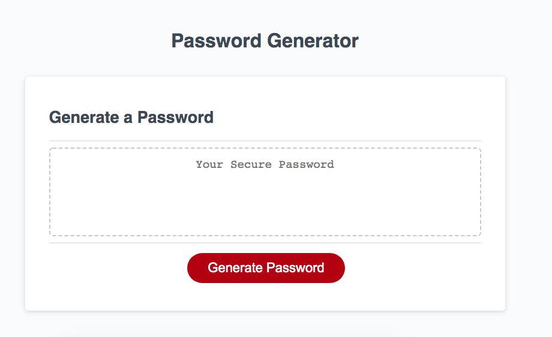
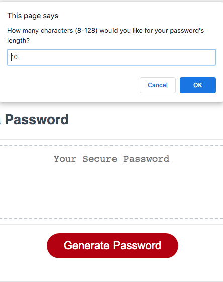
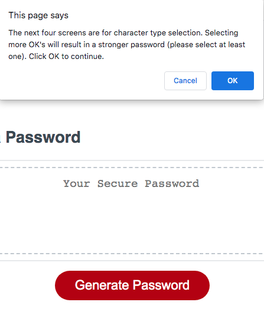
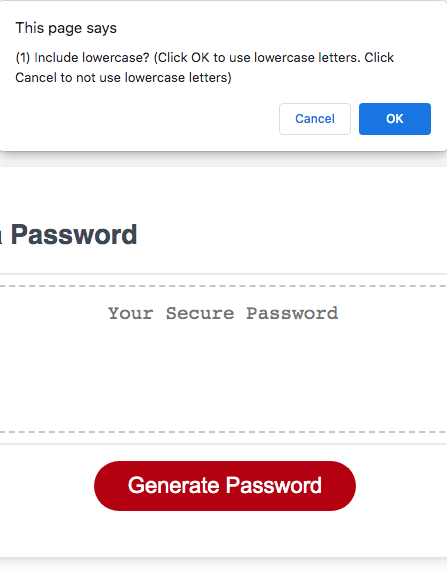
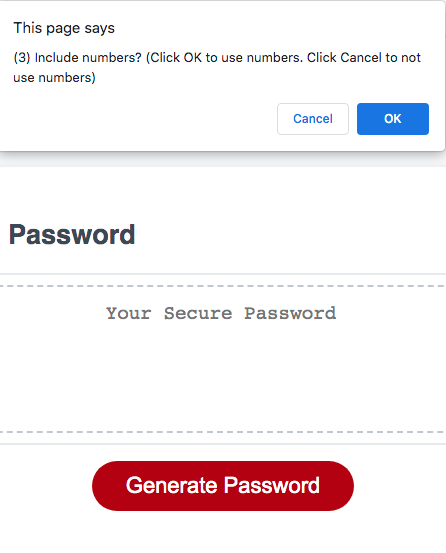
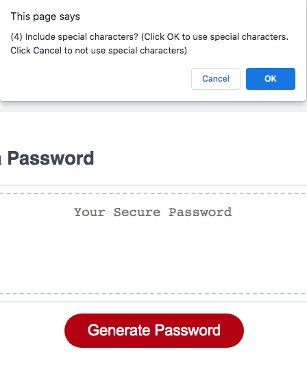
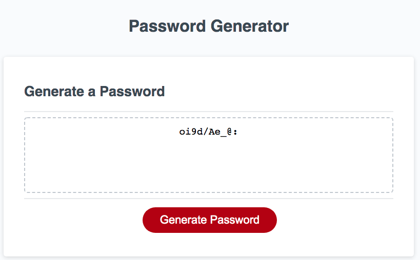

# password-generator

Summary:
 
The objective of this application is to enable the user to select prompts to generate secure and random passwords containing a variety of characters. HTML, CSS, Javascript, and Git were used, but the primary focus was Javascript. The final result displays a password that is written onto the page and can be copied and pasted for future use. This code was updated from provided starter code in the form of HTML and CSS files. The Javascript was independently written. If convenient, please render using Chrome.  

 
Breakdown:
 
Once the user clicks the red "Generate Password" button the first window asks the user for a desired password length. This input is validated, so that it is a numerical value between 8 and 128. Guidance is implemented for when it's a number less than 8, greater than 128, an empty value, and/or not a numerical value such as letters or special characters. The user is then notified that she/he will be selecting from options to include four different character types using OK's and Cancels. The following four options are for lowercase letters, uppercase letters, numbers, and special characters. Based upon these four user decisions and the specified password length from the user, a password is randomly generated and displayed onto the page. If dissatisfied with the result, the user can re-run the program again to generate a different password.  

 
URL:
 
Check out the deployed application here: https://tedheikkila.github.io/hw3-pw-generator/
  
Screenshots (displayed in order of program's natural sequence):
  (1)  

  (2)  

  (3)  

  (4)  

  (5)  

  (6)  

  (7)  

  (8)  
